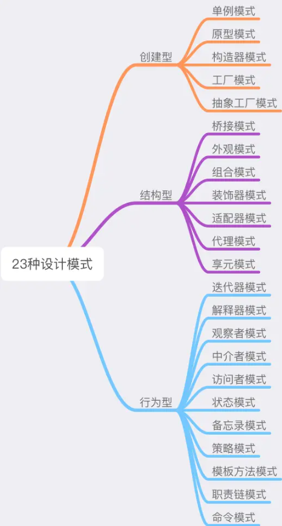

# 分类

设计原则是设计模式的指导理论，**SOLID设计原则**：

- 单一功能原则（Single Responsibility Principle）
- 开放封闭原则（Opened Closed Principle）
- 里式替换原则（Liskov Substitution Principle）
- 接口隔离原则（Interface Segregation Principle）
- 依赖反转原则（Dependency Inversion Principle）

设计模式的核心思想是：封装变化。将变与不变分离，确保变化的部分灵活、不变的部分稳定。

《设计模式：可复用面向对象软件的基础》这本书总结了23种设计模式，并将这些设计模式分为了**创建型**、**结构型**和**行为型**：

