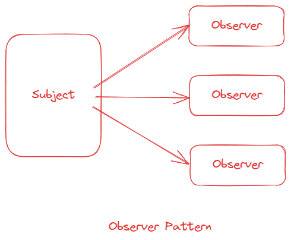

# 行为型：观察者模式

## 区别

虽然**观察者模式**经常又被叫做**发布订阅模式**，但是二者还是有区别的。

观察者模式是**被观察者（Subject）**直接通知所有的**观察者（Observer）**。被观察者和观察者之间是松耦合的。



发布订阅模式中，**发布者（Publisher）**并不直接通知所有的**订阅者（Subscriber）**，而是通过第三方的**EventChannel**。发布者和订阅者之间是完全解耦的。


## 实现

### 观察者模式

首先我们来实现`Observer`，这个类我们只需要一个`update`方法用来供`Subject`通知调用：

```ts
interface Observer {
  update(subject: Subject): void
}

class ObserverA implements Observer {
  public update(subject: Subject) {
    console.log('ObserverA updated')
  }
}

class ObserverB implements Observer {
  public update(subject: Subject) {
    console.log('ObserverB updated')
  }
}
```

接下来实现`Subject`，这个类需要实现`add(添加观察者)`、`remove(移除观察者)`和`notify(通知观察者)`三个方法，同时用`observer`私有属性来维护所有的观察者集合。

```ts
interface Subject {
  add(observer: Observer): void
  remove(observer: Observer): void
  notify(): void
}

class SubjectA implements Subject {
  private observers: Observer[]
  public constructor() {
    this.observers = []
  }
  public add(observer: Observer) {
    this.observers.push(observer)
  }
  public remove(observer: Observer) {
    const index = this.observers.findIndex(o => o === observer)
    this.observers.splice(index, 1)
  }
  public notify() {
    this.observers.forEach(observer => observer.update(this))
  }
}
```
[playground](https://www.typescriptlang.org/zh/play?#code/JYOwLgpgTgZghgYwgAgPICMDO0Bu1kDeAUMsgK4AOAJnJABSZnoBWECYAXMgMpOvsBKLjgD2wKkQC+RIggA2cTJjRZc0AILJgAWwpyI2iOGUZsUPFEIlkFJnOAJy1WhAZ82nHu8FXSpBCIgmCL6AHRyIgDmdADkpmpQmpQ0kFQxAtbS0rIKSipmFgBCWrr6hsb5Cb42dg5OKa6MLB5cvM0+xH7IAUEhEOFRsfHm0MXJLmkZpFkyoJCwiCht-GDVcFRUdCKqI1BcwxZCyKLi1lAGInhbOxb7N9BHJxKkICJgwDAAnnSPYhLZ8kUymWHk0Oj0BiMYGB3lWnRsUGAOBcyG2BWgmDu6KgAG0ALrWWzoeyOHqYMBQMjsERQH7VUhgAAWwEwoTRCWUAF5kPjMoTao51pt2bssQkBPTkEyWWz7lBWbZMIzrtipshpKQiSTkOdtJdXCLbpVdhL4f5AuStCAqBAAB7IbnS1mGjGhGCgKgASWtdq2DoAfKiHZzuS6oGqGcznXLWZg9A5XB67QAaZAARjVGpqxLqr3eXzpZqlUdl2NZMBpAFFEMqwwHUXLQuN6E6BJmpDIyasw5puSAIAB3Y0WdQ-WQW7ty4p9wfD0ZjrvIJorXvIftDkHsUcZZeg0JClUJdQ72HqfcbQ+7Qon9pgM95j7fARAA)

我们注意到在`notify()`方法调用中调用遍历调用每一个`observer`的`update()`方法时，会传递`this`，即把当前的`subject`实例传递过去。为什么需要这样做呢？因为通常`Subject`的业务类都会包含一些业务逻辑，才能实现我们实际业务中格中丰富的功能。

想像这样一个场景：**小明（`ObserverA`）**和**小红（`ObserverB`）**分别喜欢阅读某个**小说平台（`StorySubject`）**里的**小说A**和**小说B**。小说平台里所有小说更新的时候都会给关注的用户推送私信，但是小明和小红都只关心自己喜欢的小说什么时候更新。

我们目前的实现，`notify()`调用时，会无差别调用所有`observer`的`update()`方法。但是上面的场景中小明和小红都只关心各自喜欢的小说的更新情况。那么在`StorySubject`中引入额外的状态就可以通过状态判断来做到这一点了。我们来改造`StorySubject`：

```ts
class StorySubject implements Subject {
  /**
   * 业务状态，0代表A小说更新了，1代表B小说更新了
   */
  public state = 0


  /**
   * 业务逻辑，模拟状态更新，通知观察者
   */
  public changeState() {
    this.state = Math.random() > 0.5 ? 1 : 0
    this.notify()
  }
}
```

改造`Observer`类：

```ts
class ObserverA implements Observer {
  public update(subject: Subject) {
    if (subject && subject instanceof StorySubject && subject.state === 1) {
      console.log('A小说更新了')
    }
  }
}

class ObserverB implements Observer {
  public update(subject: Subject) {
    if (subject && subject instanceof StorySubject && subject.state === 0) {
      console.log('B小说更新了')
    }
  }
}
```

通过对`subject.state`的判断，小明和和小红都能知道自己喜欢的小说何时更新了：

```ts
const observerA = new ObserverA() // 小明
const observerB = new ObserverB() // 小红
const storySubject = new StorySubject()
storySubject.add(observerA)
storySubject.add(observerB)
storySubject.changeState()  // A/B小说更新了（取决于当前state的值）
```

[playground](https://www.typescriptlang.org/zh/play?#code/JYOwLgpgTgZghgYwgAgPICMDO0Bu1kDeAUMsgK4AOAJnJABSZnoBWECYAXMgMpOvsBKLjgD2wKkQC+RIggA2cTJjRZc0AILJgAWwpyI2iOGUZsUPFEIlkFJnOAJy1WhAZ82nHu8FXSpYDDIbiweyABkYciMIexaIJhgcCBIIoHcYCJQAJ68MWDhkdH8YAB0CS7IALzVyACMAr5+pAgi8SL6JXIiAOZ0AOTqgPA6gC-RgC9mgA2mgGFyfQLWpNLzUjLyiiaq5tAAQlq6+obGKmYWjbbo9o6UNPRFHly5xQ3ETQFBN7ERUd75oOXJEKk8DLZe6hD5vUrlSBVGoABkecz8LTaHS6vT6mxGE2msyaC2Q0mkRFAkFgiBQINiT2QcCoVDoInWFi4pjUUCEyFE4msUAMIjw9MZ0GZgrZwjEElIIBEYACWTo7M5EkJKyUgMyOS+Oz0BiMYGUFPyVIA9AAqE1zE3IQBYcoBCpUAbU6AQANADD-MMAx3KACwihmMpk7ah6Md7JhajdZTucookoZVkDCZKQKFBgDgKgyjtBMMK01AANoAXVDdgcyCRCSgZHYmXljVIYAAFsBMCVU6zlNG89Y8WGizS6c2NlBM6z4U06w2myLG7ZMLWBVmcfiC2cizztHzXH2mYch9Xi60EnEqBAAB5VZCjxsb9MlGCgKgASRAh6P9KqAD5kCJodHL2yEefx1mjaYHoDiuLex4ADR1POnaFo4UoyjAcrDn4-4-o2MCZAAoogM4-m+H4iiUlwuHQ54CDBcbIKa5p+JatqANwJgCJ8U6gCEVoA+0aOhMTqAFgJgCn7oAQ5GAPvagCgAcGi7hggtZJN0EDpKRKE1vWQGRig0YALK0LWJRQEkVAiNoVbvjCJQAKzIAA-HUyBcLGI7KSUCGyvKHZLLIe75D+mjRiAEAAO5bv26guSWnkitsPn+YFFibCFHkRuqBqnr5AXpIlXwuQk6V5CUPazqy6izFlwJfLltL5f2mxFUCGo5VJMlyap8pAA)

### 发布订阅模式

发布订阅模式需要实现三个类：`Publisher`、`Subscriber`和`EventChannel`：

```ts
type Callback = (...args: unknown[]) => void

// 发布者
interface Publisher {
  eventName: string
  data: any
}

// 订阅者
interface Subscriber {
  eventName: string
  callback: Callback
}

// 事件总线
interface EventChannel {
  on: (eventName: string, callback: Callback) => void
  off: (eventName: string, callback: Callback) => void
  emit: (eventName: string, data: any) => void
}
```

分别实现它们：

```ts
class ConcretePublisher implements Publisher {
  public eventName: string
  public data: any
  constructor(eventName: string, data: any) {
    this.eventName = eventName
    this.data = data
  }
}

class ConcreteSubscriber implements Subscriber {
  public eventName: string
  public callback: Callback
  constructor(eventName: string, callback: Callback) {
    this.eventName = eventName
    this.callback = callback
  }
}

class ConcreteEventChannel implements EventChannel {
  private handlers: Map<string, Callback[]>

  constructor() {
    this.handlers = new Map()
  }

  public on(eventName: string, callback: Callback) {
    if (!this.handlers.has(eventName)) {
      this.handlers.set(eventName, [])
    }

    this.handlers.get(eventName)!.push(callback)
  }

  public off(eventName: string, callback: Callback) {
    const callbacks = this.handlers.get(eventName)
    if (callbacks) {
      const index = callbacks.indexOf(callback)
      if (index !== -1) {
        callbacks.splice(index, 1)
      }
    }
  }
  
  public emit (eventName: string, ...args: unknown[]) {
    const callbacks = this.handlers.get(eventName)
    if (callbacks) {
      callbacks.forEach((callback) => {
        callback(...args)
      })
    }
  }
}
```

用例：

```ts
const sub1 = new ConcreteSubscriber('ready', (...args) => {
  console.log('sub1接收到ready事件', args)
})

const sub2 = new ConcreteSubscriber('ready', (...args) => {
  console.log('sub2接收到ready事件', args)
})

const pub1 = new ConcretePublisher('ready', {
  message: 'pub1',
  data: 1
})

const pub2 = new ConcretePublisher('ready', {
  message: 'pub2',
  data: 2
})

const eventChannel = new ConcreteEventChannel()
eventChannel.on(sub1.eventName, sub1.callback)
eventChannel.on(sub2.eventName, sub2.callback)
eventChannel.emit(pub1.eventName, pub1.data)
eventChannel.off(sub2.eventName, sub2.callback)
eventChannel.emit(pub2.eventName, pub2.data)

/**
 * [LOG]: "sub1接收到ready事件",  [{"message": "pub1","data": 1}] 
 * [LOG]: "sub2接收到ready事件",  [{"message": "pub1","data": 1}] 
 * [LOG]: "sub1接收到ready事件",  [{"message": "pub2","data": 2}] 
 */
```

[playground](https://www.typescriptlang.org/zh/play?#code/C4TwDgpgBAwghgGwQIzgYwNZQLxQBQB0RcATgOYDOAXFAK4B2G9A9gO70DaAugJQ4B8UAG7MAlgBMAUJID0MqIEXlQMB6gUADJo+sAgkAZumgAFWsgSiKAC21QA3pKhQIQiJoBycALYQaFYCQ1k7KHE4YDgaOHoQSQBfaTkoQCLowFA0tQ0tXX0oAGVjCjQ-ZCtbe0dnYDdPb19-QLREFHQMGngkVEwYuPlAaLlAN7lAbgNAfr91TW09NGgAUSdNGHMI+ggEG0Dmeho8UtcPLygfP3oyABooOtbG5vq2jD5sQREJFZ0ddc3y7ar9o5PL89gfzBudzEUhK7lEwBe0zelV21QOx2CoXCkUBwmBHUkaAQcAoFFgq3yEC0UzKs3miygoncYAQEE8mjxJJmc3oCyWxSgYD8QhC0BZ4lpJGoUAAsnAwAAePb+Y4tBqYbj8aT2NCrPa0NDAZgkPB8Dn2YDmMwEfmCvG4BasUXi3WBWKBMDGUxoKCrDZQio7aXw75nTAXP3XZb2eyiHT4ACEhuNpu0FBNOPdZU9PD1gRDUGj8djQoIFCJSa2nmO3B46ag9ozWYT9AFcYIZALrxTEYIjoseFO8uuduVnKdohdzCehehXrhXy7VwD3bTGdV9B8vu75szRuzETrucbwFHKfLYfwU8aFDnGZOauAlNrEAAHjhl1d4xpxHeAPI6Tv-HvnynhvAvneUARtguAALQAIxnr+x6YPGFA0oOEAATet7HFB5b2LEGbYRWgQOgOLp0uC+DNu8sKfMcRAEKQlA0AwTBsJwvDBiGC5LrBGCrtWObxjue7bGWGaHl+ganqx87fvGOjahM6DmHgomzgIEnnpxhDEOQp6YRWQkhrhsT2liOJ4jABIkESEBGCYZiWCQlLUrS9LAHi1mmBYRQETZREeuR3oBPYjreUEIRhFAERRCql4kBqWo6mRML+QioXIiA0FrsaCXQLgWXltWiJwA+BW9kZ2K4vi9CEloOTIHkBRWFSNJ0mUeI1XVoiFPZHJBc6Di+YlE5eb1nEzlctTRbF2oCQNlGPr8cpXOl1ZZQ+uVVuuBCcQ+nElZ0UCABSugDR8oAWP-SOxV4UMYEEPpaFVVRAbX5B12h4AA5BZcDiCAr3HBpNFaaiHLscwtIEAgzBkG9l3IBBgClxoAbKaAAxKH1fb0P3hQDMRlpil67MYABMN0QFaZmVRZ1W5E9nVvSj32-dRtHibcrHA6D4OQ690P4wjyMQJ9IBo8cjNltE2Pnf2MNEyT5mWW5tkve9fNfejHKeLicCNjQr1BRBP2BAVNAQVjZ240FhMWsTd3k1ZA4eTqiv8yrgRqxQGs7NrBN6-YBtQPjxs44uV6vGSrIUhb0tk5ZTLACHbK2sHLJsgQbrQxBBBZccqebd+ZYJ+SCDJ-QeBc+n-UQJnBPZ4GudQrHizp2Cu466XybbMczcFTXpKJ-Xw6fiXGd48g+NV7Okh56HBfEU3leD2bBCd3EABUS92EvUAcAAMm+ADiXA0AARKnPO070B-HBv1gHy7bsH4fOvnwfBV31AEHRFwUBrxv2974fXMn0rAWPRz72A4FfG+jYX4HwfocJ+oUX5vw-l-Leu995QCPldAB-Mz4XzAdfCA6tIH3wJo-Z+NB8bv0-lAJeMhpB0KAA)

其实上面实现的发布订阅模式和我们常见的实现`EventEmitter`基本一致，不过是弱化了`Publisher`和`Subscriber`两个类，只实现一个`EventChannel`。


