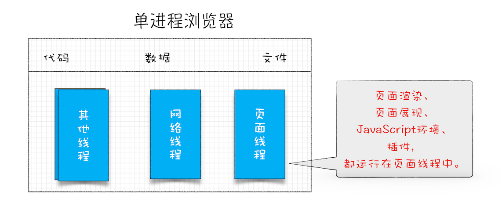
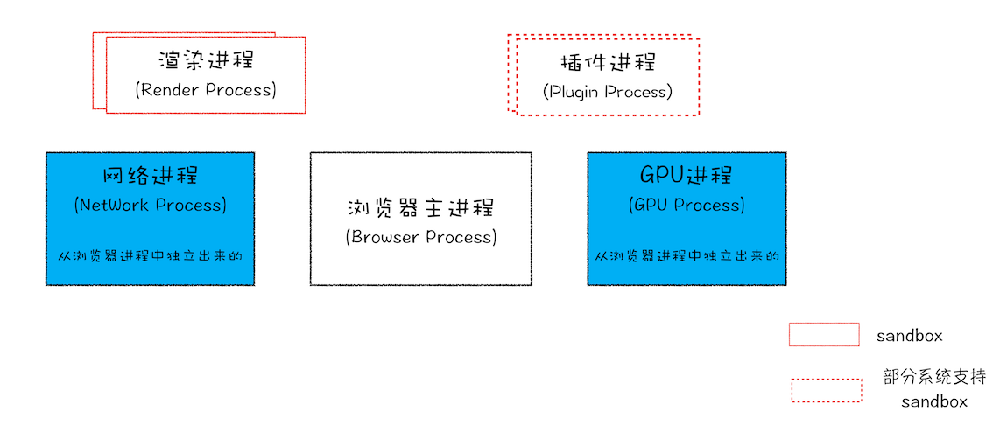
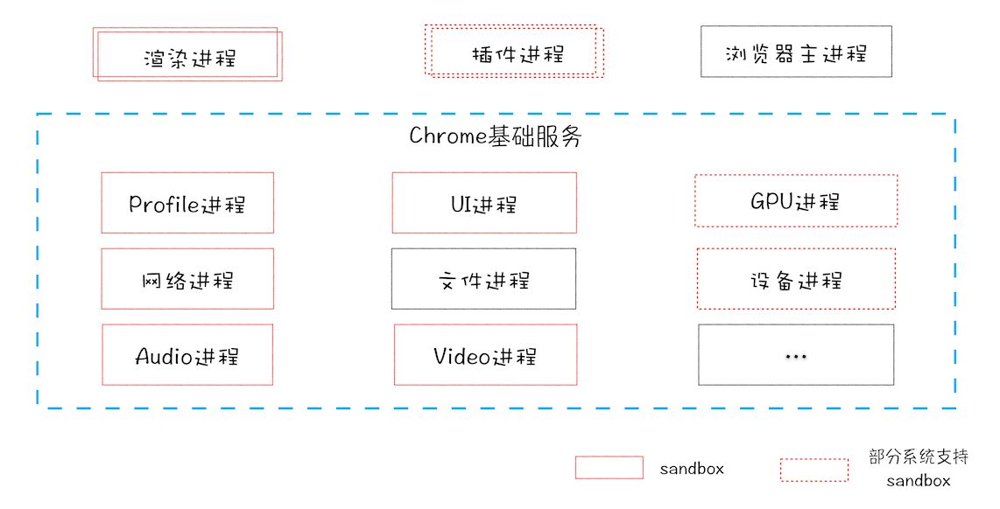
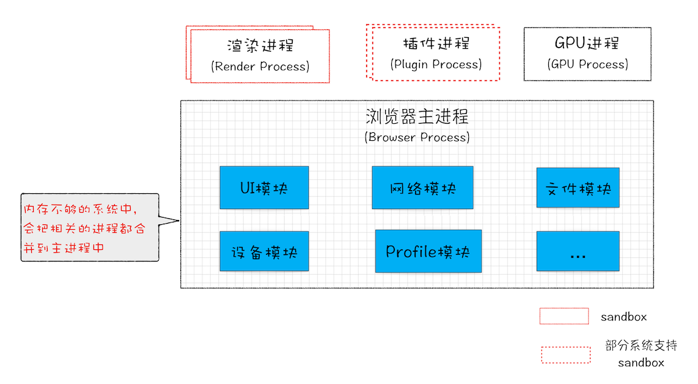

# Chrome架构模型

## 进程和线程

进程是资源分配的最⼩单位，线程是程序执⾏的最⼩单位（资源调度的最⼩单位）。

一个进程就是一个程序的运行实例。详细解释就是，启动一个程序的时候，操作系统会为该程序创建一块内存，用来存放代码、运行中的数据和一个执行任务的主线程，我们把这样的一个运行环境叫进程。

线程是依附于进程的，进程中使用多线程并行处理能提升运算效率。

- 进程中的任意一线程执行出错，都会导致整个进程的崩溃。
- 线程之间共享进程中的数据。
- 当一个进程关闭之后，操作系统会回收进程所占用的内存（泄露的内存也会随着进程关闭而被回收）。
- 进程之间的内容相互隔离，使用IPC机制进行进程间通信。

## 单进程浏览器时代

2007年之前浏览器都是单进程架构的，这会导致一些问题：

- **不稳定** 插件和渲染引擎不稳定，一旦崩溃，就会导致整个浏览器进程崩溃。
- **不流畅** 所有页面的渲染模块、JavaScript执行环境以及插件都是运行在同一个页面线程中的，如果一个耗时或死循环脚本执行，所有页面都会卡住。另外页面如果有内存泄漏，关闭后泄漏的内存也不会不会，这就导致浏览器越来越慢。
- **不安全** C/C++等插件可以获取到操作系统的任意资源，页面脚本也可以通过浏览器漏洞来获取系统权限，总之就是权限过高。

## 多进程浏览器时代

### 早期多进程架构

下图是2008年Chrome发布时的进程架构

- **解决了不稳定的问题** 每个标签页和插件都是一个独立的进程，而进程之间是相互隔离的，一个插件或页面崩溃不会导致其它页面乃至整个浏览器的崩溃。
- **解决了不流畅的问题** 每个标签页都会开启一个渲染进程，JavaScript的执行只会影响当前的页面渲染，而不会影响其它的渲染进程，更不会影响浏览器主进程。另外，关闭一个页面时该页面的渲染进程也会被关闭，进程占用的内存会被回收，这就解决了内存泄漏的问题。
- **解决了不安全的问题** 渲染进程和插件进程运行在安全沙箱中，即使渲染进程或插进程里执行了恶意程序，也无法突破沙箱去获取系统权限。

### 现阶段多进程架构

最新的Chrome浏览器包括：

- 1个浏览器进程：负责界面显示、用户交互、子进程管理、存储等功能。浏览器进程内部会开启多个线程处理不同的任务。
- 1个GPU进程：负责绘制Chrome和网页的UI界面。
- 1个网络进程：负责网络资源加载。网络进程内部会开启多个线程处理不同的网络任务。
- 多个渲染进程：负责把HTML、CSS、JavaScript解析渲染成可交互的页面，运行在沙箱中。每个标签页都会开启一个渲染进程，渲染进程启动后，会开启一个渲染主线程，上面说的页面解析渲染的过程和JavaScript的执行都在渲染主线程上。
- 多个插件进程：每个插件都有一个独立的插件进程，因为插件易崩溃，通过进程隔离就不会影响到页面和整个浏览器。

### 未来面向服务的架构(Services Oriented Architecture，简称SOA)

Chrome还提供灵活的弹性架构，在强大性能设备上会以多进程的方式运行基础服务，但是如果在资源受限的设备上（如下图），Chrome会将很多服务整合到一个进程中，从而节省内存占用。

