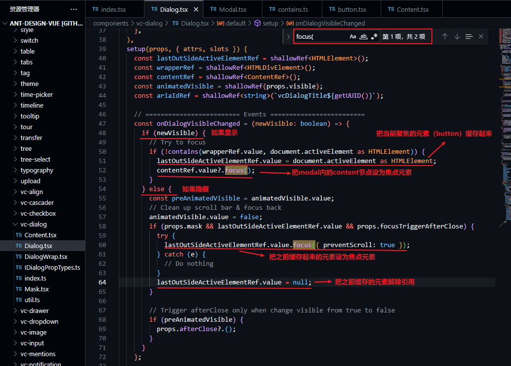

# 你知道ant-design-vue中modal组件的这个feature吗？

## 背景
这个问题始于测试同学提了一个bug:

> a-modal弹窗关闭后，键盘回车键会重新打开弹窗。但如果关闭弹窗后鼠标在页面空白处点击后，回车键就不会打开弹窗了。

## 分析问题

首先到ant-design-vue官网按这个步骤试了一下，是可以复现这个现象的，就排除了业务代码的影响。

然后又去element-ui官网试了一下，并没有复现这个现象。到此为止，**初步猜测，这是ant-design-vue有意为之的一个feature，而不是一个bug**。接下来记录下我是怎么一步步分析和验证这个猜想的。

一开始，根据以往的知识，猜测和**无障碍访问**的行为有关，看了a-modal上相关的html attribute然后搜索了一番，无果，感觉自己猜的跑偏了，于是从头开始梳理思路。

然后，想到既然是鼠标回车键按下会重新打开弹窗，那键盘事件总得作用在某个目标元素上吧？这个元素是什么呢？就是页面当前focus的元素，通过`document.activeElment`可以获取到当前页面focus的元素。

在ant-design-vue官网测试了下，点击按钮打开弹窗后，控制台输入`document.activeElment`，返回`<div tabindex="0" aria-hidden="true" style="width: 0px; height: 0px; overflow: hidden; outline: none;"></div>`，这是a-modal中的某个dom节点。关闭弹窗后，控制台输入`document.activeElment`，返回`<button class="ant-btn ant-btn-primary" type="button" ant-click-animating-without-extra-node="false"><!----><span>Open Modal</span></button>`，这是一开始我们点击的按钮。

经过上面的测试，得出一个结论：**a-modal在显示和隐藏时，`document.activeElement`的值会发生变化，隐藏时`document.activeElement`会切换回显示之前的值**。

根据上面的结论，进一步猜测应该是**a-modal源码里在显隐切换时手动切换了页面的focus元素**，使用[el.focus()](https://developer.mozilla.org/en-US/docs/Web/API/HTMLElement/focus)可以做到切换页面的focus元素。

接下来就是在源码里查找有没有什么地方调用了`focus(`（这里为什么不搜索`focus()`呢，因为`focus`方法可以传入参数，如果源码中传入了参数就无法匹配到搜索了），打开[ant-design-vue的github主页](https://github.com/vueComponent/ant-design-vue)，通过键盘上的`.`键切换到在线编辑器，找到modal组件的源码目录：`/components/Modal/Modal.tsx`，在该文件中搜索`focus(`关键字，但并没有搜到，但是看见文件末尾`return`语句里其实渲染了一个`Dialog`组件：

```tsx
return wrapSSR(
  <Dialog
    {/* 此处省略若干代码 */}
  ></Dialog>,
);
```

于是又去`/components/vc-dialog/Dialog.tsx`中搜索`focus(`，搜索到一个方法中有两处调用：



最关键的代码我用红线标了出来，其它代码都不重要可以忽略。它的基本策略是：

- modal显示的时候，把`document.activeElement`指向的元素用一个变量缓存起来，把modal里的content节点设为焦点元素。
- modal隐藏的时候，把之前缓存起来的元素设为焦点元素，把用来缓存的变量设为null来解除对元素的引用。

## 总结
到此为止，从源码中找到了这个“bug”发生的原因，这实际上并不是一个bug，而是ant-design-vue有意设计的一个feature，但是这么做的意图是什么目前也不是很清楚，可能还是和无障碍访问有一定的关系。