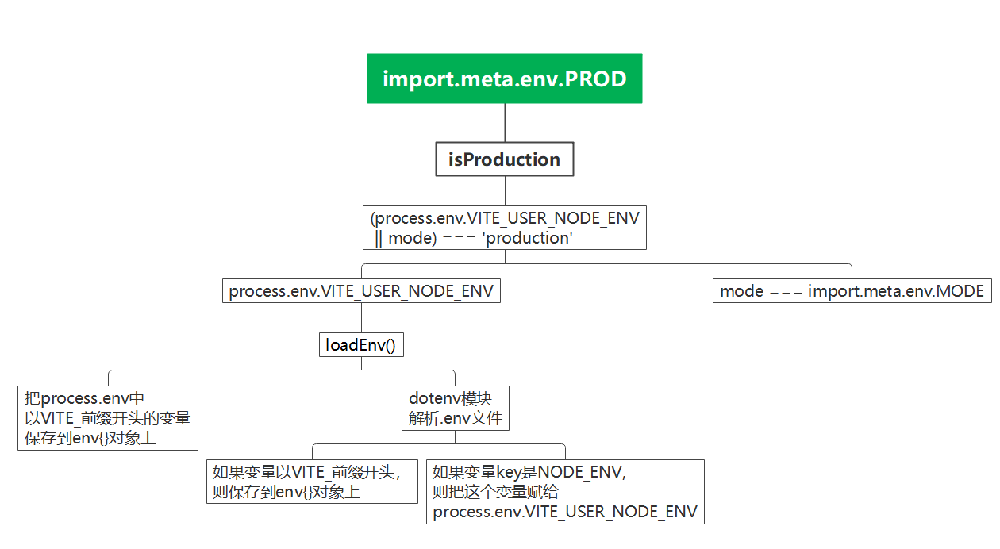

# Vite环境变量的坑

## 需求

Vite常用的命令有`vite dev`和`vite build`，项目会部署在开发环境和生产环境（可能还有别的环境，我们暂时不考虑，只考虑最简单的场景）。方便起见，我们后面都用**阶段**和**模式**这两个概念来描述：

- **阶段**：开发阶段(`vite dev`) 和 构建阶段(`vite build`)
- **模式**：开发模式(development) 和 生产模式(production)

我们可能想实现这样的需求：

1. 每个模式都有对应的配置文件，用来维护同样一组变量在不同模式下的值
2. 通过在`package.json`的`scripts`字段中声明不同命令，可以让不同阶段和模式起到排列组合使用的效果。这样的好处是，我们在开发的时候可能想使用生产模式的变量，不用改配置文件，直接运行相应的命令即可。

| 命令 | `npm run dev` |  `npm run dev:prod` |  `npm run build:dev` |  `npm run build:prod` |
| :-: | :-: | :-: | :-: | :-: |
| 开发阶段 | ✅ | ✅ | ❌ | ❌ |
| 构建阶段 | ❌ | ❌ | ✅ | ✅ |
| 开发模式 | ✅ | ❌ | ✅ | ❌ |
| 生产模式 | ❌ | ✅ | ❌ | ✅ |

## 实现

简单看了下[Vite官网](https://cn.vitejs.dev/guide/env-and-mode.html)，发现它有一个 **模式(mode)** 的概念恰好和我们上面说得模式的概念一致。

- `mode`值可以使用`import.meta.env.MODE`访问
- 不同的vite命令，`mode`有各自的默认值：
  - `vite dev`：默认`development`
  - `vite build`：默认`production`
- `mode`默认值可以通过传递 `--mode` 选项标志来覆盖命令使用的默认模式：
  - `vite dev --mode production`
  - `vite build --mode development`
- Vite会使用`dotenv`自动加载项目根目录下的`.env.${mode}`下的环境变量

现在我们已经可以通过`import.meta.env.MODE`来区分不同的模式了，那么怎么区分不同的阶段呢？我注意到这两个变量：

> - `import.meta.env.DEV`: {boolean} 应用是否运行在开发环境 (永远与 import.meta.env.PROD相反)
> - `import.meta.env.PROD`: {boolean} 应用是否运行在生产环境。

我原本以为这两个变量就正好对应了开发阶段和构建阶段，但测试后发现它其实只和`mode`有关，与所处的阶段没有关系：

```js
import.meta.env.DEV === (import.meta.env.MODE === 'development')
import.meta.env.PROD === (import.meta.env.MODE === 'production')
```

那有没有办法使得`import.meta.env.DEV`和`import.meta.env.PROD`符合我们的预期与阶段对应呢？我查看了Vite源码发现是可行的。

首先在[Vite源码仓库](https://github.com/vitejs/vite)页面按下键盘的`.`键，即可跳转到在线vscode编辑器查看仓库源码。我们区分大小写全局查找`PROD`，定位到`import.meta.env.PROD`定义在`/packages/vite/src/node/config.ts`文件下。

```ts
const resolved: ResolvedConfig = {
  // ...
  env: {
    ...userEnv,
    BASE_URL,
    MODE: mode,
    DEV: !isProduction,
    PROD: isProduction  // 453行
  },
  // ...
}
```
我们接着看453行的`isProduction`的定义：

```ts
const userEnv =
    inlineConfig.envFile !== false &&
    loadEnv(mode, envDir, resolveEnvPrefix(config)) // 348行

// Note it is possible for user to have a custom mode, e.g. `staging` where
// production-like behavior is expected. This is indicated by NODE_ENV=production
// loaded from `.staging.env` and set by us as VITE_USER_NODE_ENV
const isProduction = (process.env.VITE_USER_NODE_ENV || mode) === 'production'  // 353行
if (isProduction) {
  // in case default mode was not production and is overwritten
  process.env.NODE_ENV = 'production'
}
```
可以看到，这里和我刚才的推测`import.meta.env.PROD === (import.meta.env.MODE === 'production')`已经很接近了，这里的`mode`就是`import.meta.env.MODE`，我们来看看`process.env.VITE_USER_NODE_ENV`又是什么。


```ts
export function loadEnv(  // 967行
  mode: string,
  envDir: string,
  prefixes: string | string[] = 'VITE_'
): Record<string, string> {
  if (mode === 'local') {
    throw new Error(
      `"local" cannot be used as a mode name because it conflicts with ` +
        `the .local postfix for .env files.`
    )
  }
  prefixes = arraify(prefixes)
  const env: Record<string, string> = {}
  const envFiles = [
    /** mode local file */ `.env.${mode}.local`,
    /** mode file */ `.env.${mode}`,
    /** local file */ `.env.local`,
    /** default file */ `.env`
  ]

  // check if there are actual env variables starting with VITE_*
  // these are typically provided inline and should be prioritized
  for (const key in process.env) {
    if (
      prefixes.some((prefix) => key.startsWith(prefix)) &&
      env[key] === undefined
    ) {
      env[key] = process.env[key] as string
    }
  }
  /**
   * 上面的代码主要干了一件事，遍历`process.env`里的变量
   * 把以`VITE_`开头的变量存储到`env`对象中
   */

  /**
   * 下面的for循环主要做了这些事：
   * 1. 用dotenv模块解析所有的`.env.${mode}`文件
   * 2. 把第1步解析出的变量中，以`VITE_`开头的变量存储到`env`对象中
   * 3. 再第2步中额外判断，如果变量的key是NODE_ENV，就把process.env.VITE_USER_NODE_ENV设为NODE_ENV的值
   */
  for (const file of envFiles) {
    const path = lookupFile(envDir, [file], true)
    if (path) {
      const parsed = dotenv.parse(fs.readFileSync(path), {
        debug: !!process.env.DEBUG || undefined
      })

      // let environment variables use each other
      dotenvExpand({
        parsed,
        // prevent process.env mutation
        ignoreProcessEnv: true
      } as any)

      // only keys that start with prefix are exposed to client
      for (const [key, value] of Object.entries(parsed)) {
        if (
          prefixes.some((prefix) => key.startsWith(prefix)) &&
          env[key] === undefined
        ) {
          env[key] = value
        } else if (key === 'NODE_ENV') {
          // NODE_ENV override in .env file
          process.env.VITE_USER_NODE_ENV = value  // 1021行
        }
      }
    }
  }
  return env
}
```
可以看到代码中定义了`loadEnv`函数，代码内容较多，我在其中做了注释，这里不再赘述。我画了一张思维导图，应该能更清晰的描述这个过程。



那到这里，其实我们可以确定了，如果我们没有在`.env.${mode}`文件中设置过`NODE_ENV`变量，那`import.meta.env.PROD`的值就是`import.meta.env.MODE === 'production'`的返回值，与我们上面的猜想一致。

那如果我们在`.env.${mode}`文件中设置了`NODE_ENV`，则`import.meta.env.PROD`还是与模式绑定的：

```.env
# .env.production
NODE_ENV = production # 如果设置为production，不论vite dev:prod还是vite build:prod，import.meta.env.PROD的值都是ture。结果还是与mode绑定的
```

其实我们只需要在命令行设置`VITE_USER_NODE_ENV`环境变量即可：

```sh
VITE_USER_NODE_ENV=development vite dev --mode development
VITE_USER_NODE_ENV=development vite dev:prod --mode production
VITE_USER_NODE_ENV=production vite build:dev --mode development
VITE_USER_NODE_ENV=production vite build:prod --mode production
```

但是要在`scripts`中设置环境变量需要借助`cross-env`包：

```sh
npm install -D cross-env
```

```json
{
  "scripts": {
    "dev": "cross-env VITE_USER_NODE_ENV=development vite --mode development",
    "dev:prod": "cross-env VITE_USER_NODE_ENV=development vite --mode production",
    "build:dev": "cross-env VITE_USER_NODE_ENV=production vite build --mode development",
    "build:prod": "cross-env VITE_USER_NODE_ENV=production vite build --mode production"
  }
}
```

